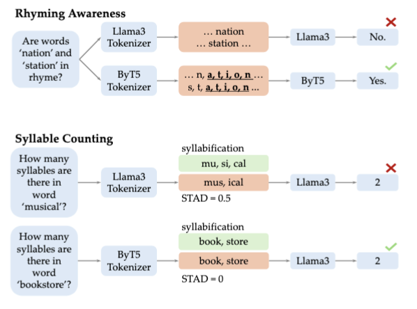

# Tokenization-Phonology



This project studies how tokenization shapes phonological reasoning in language models. As illustrated in Figure 1, standard subword tokenization can obscure local sound patterns such as rhyme and misalign with natural syllable boundaries, which hurts tasks like rhyming awareness and syllable counting. This repository analyzes these failures through probing, introduces the syllabification-tokenization alignment distance (STAD) to measure token-syllable mismatch, and explores IPA-based fine-tuning to improve phonological understanding in existing text-only language models.

This repository contains code for:

- fine-tuning language models on phonology-oriented data
- generating hidden-state embeddings for probing
- training probes for grapheme-to-phoneme and syllable-related tasks

**Environment Setup**

This project is easiest to set up with `uv`.

1. Create and activate a virtual environment:

```bash
uv venv
source .venv/bin/activate
```

2. Install PyTorch for your machine.

For NVIDIA systems with CUDA 12.8:

```bash
uv pip install torch torchvision --index-url https://download.pytorch.org/whl/cu128
```

3. Install the Python dependencies used by fine-tuning and probing:

```bash
uv pip install \
  transformers==4.49.0 \
  datasets==3.3.2 \
  accelerate==0.34.0 \
  peft==0.14.0 \
  trl==0.15.1 \
  bitsandbytes \
  numpy==1.26.4 \
  pandas==2.2.3 \
  scikit-learn==1.6.1 \
  scipy==1.15.2 \
  tqdm==4.67.1 \
  sentencepiece==0.2.0 \
  panphon
```


**Probing**

In `datasets/`, there are our generated data for different language models. 
The probing workflow has two stages

1. Generate embeddings from a model for the probing datasets.
2. Train linear probes on the saved embeddings.

The repository includes a helper script, `probing.sh`, that runs both stages for Llama3.1-8B model.

Run:

```bash
bash probing.sh
```

The current script does the following:

1. Generate embeddings for the `good` and `bad` ARPAbet datasets:

```bash
python probing/generate_embedding.py --file_dir datasets --file_name arpabet_data_llama3_good.csv --LLM llama3.1 --layers -1 --feature g2p
python probing/generate_embedding.py --file_dir datasets --file_name arpabet_data_llama3_bad.csv --LLM llama3.1 --layers -1 --feature g2p
```

2. Train the probes:

```bash
python probing/train_probe_g2p.py --LLM llama3.1
python probing/train_probe_syl.py --LLM llama3.1
```

3. Run control-task variants:

```bash
python probing/train_probe_g2p.py --LLM llama3.1 --control_task_label
python probing/train_probe_syl.py --LLM llama3.1 --control_task_label
```

Generated embedding files are written under [`embeddings/`](/home/disen/projects/aip-fredashi/disen/Tokenization-Phonology/embeddings), and probing outputs are written under [`results/`](/home/disen/projects/aip-fredashi/disen/Tokenization-Phonology/results).


**Fine-Tuning**

The fine-tuning entrypoints are under [`src/`](/home/disen/projects/aip-fredashi/disen/Tokenization-Phonology/src), and the current SLURM launcher is [`finetune2.sh`](/home/disen/projects/aip-fredashi/disen/Tokenization-Phonology/finetune2.sh).

Example:

```bash
bash finetune2.sh
```

If you do not use Weights & Biases, pass `--report_to none` or export:

```bash
export WANDB_DISABLED=true
```

before launching training.
